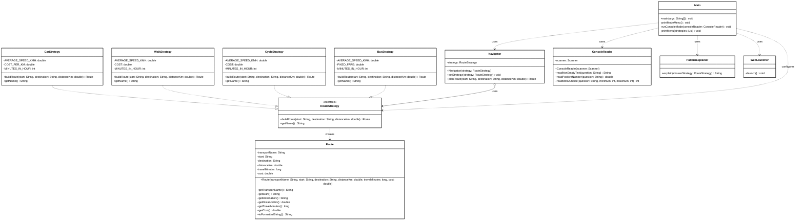

# UML Class Diagram - Strategy Pattern

```mermaid
%%{init: {'theme': 'base', 'themeVariables': {'primaryColor': '#ffffff', 'primaryBorderColor': '#000000', 'primaryTextColor': '#000000', 'lineColor': '#000000', 'secondaryColor': '#ffffff', 'tertiaryColor': '#ffffff', 'background': '#ffffff'}}}%%
classDiagram
    class RouteStrategy {
        <<interface>>
        +buildRoute(start: String, destination: String, distanceKm: double) Route
        +getName() String
    }

    class CarStrategy {
        -AVERAGE_SPEED_KMH: double
        -COST_PER_KM: double
        -MINUTES_IN_HOUR: int
        +buildRoute(start: String, destination: String, distanceKm: double) Route
        +getName() String
    }

    class WalkStrategy {
        -AVERAGE_SPEED_KMH: double
        -COST: double
        -MINUTES_IN_HOUR: int
        +buildRoute(start: String, destination: String, distanceKm: double) Route
        +getName() String
    }

    class CycleStrategy {
        -AVERAGE_SPEED_KMH: double
        -COST: double
        -MINUTES_IN_HOUR: int
        +buildRoute(start: String, destination: String, distanceKm: double) Route
        +getName() String
    }

    class BusStrategy {
        -AVERAGE_SPEED_KMH: double
        -FIXED_FARE: double
        -MINUTES_IN_HOUR: int
        +buildRoute(start: String, destination: String, distanceKm: double) Route
        +getName() String
    }

    class Navigator {
        -strategy: RouteStrategy
        +Navigator(strategy: RouteStrategy)
        +setStrategy(strategy: RouteStrategy) void
        +planRoute(start: String, destination: String, distanceKm: double) Route
    }

    class Route {
        -transportName: String
        -start: String
        -destination: String
        -distanceKm: double
        -travelMinutes: long
        -cost: double
        +Route(transportName: String, start: String, destination: String, distanceKm: double, travelMinutes: long, cost: double)
        +getTransportName() String
        +getStart() String
        +getDestination() String
        +getDistanceKm() double
        +getTravelMinutes() long
        +getCost() double
        +toFormattedString() String
    }

    class ConsoleReader {
        -scanner: Scanner
        +ConsoleReader(scanner: Scanner)
        +readNonEmptyText(question: String) String
        +readPositiveNumber(question: String) double
        +readMenuChoice(question: String, minimum: int, maximum: int) int
    }

    class PatternExplainer {
        +explain(chosenStrategy: RouteStrategy) String
    }

    class WebLauncher {
        +launch() void
    }

    class Main {
        +main(args: String[]) void
        -printModeMenu() void
        -runConsoleMode(consoleReader: ConsoleReader) void
        -printMenu(strategies: List) void
    }

    CarStrategy ..|> RouteStrategy
    WalkStrategy ..|> RouteStrategy
    CycleStrategy ..|> RouteStrategy
    BusStrategy ..|> RouteStrategy
    Navigator o--> RouteStrategy : uses
    RouteStrategy ..> Route : creates
    Main ..> Navigator : uses
    Main ..> RouteStrategy : configures
    Main ..> ConsoleReader : uses
    Main ..> PatternExplainer : uses
    Main ..> WebLauncher : uses
```
